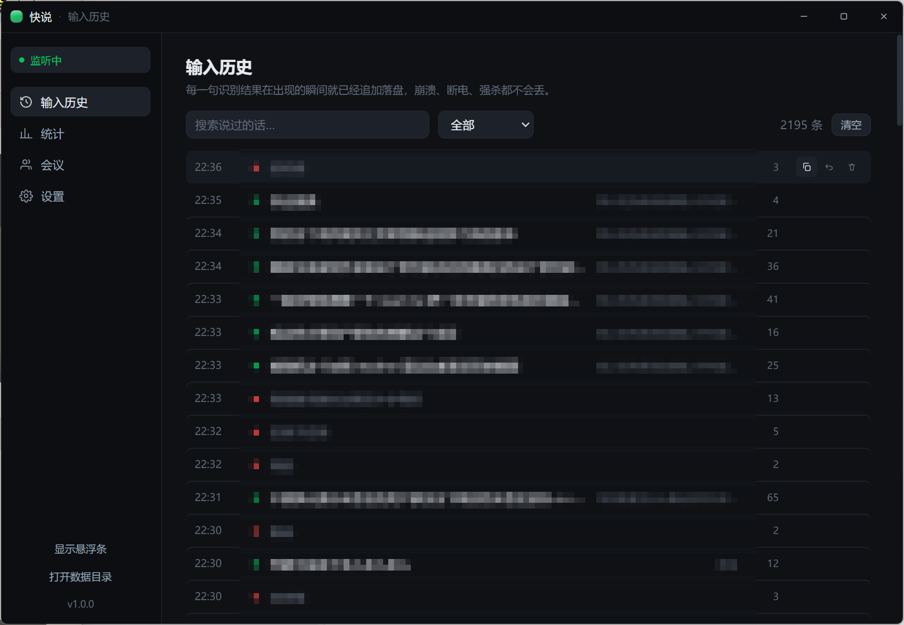
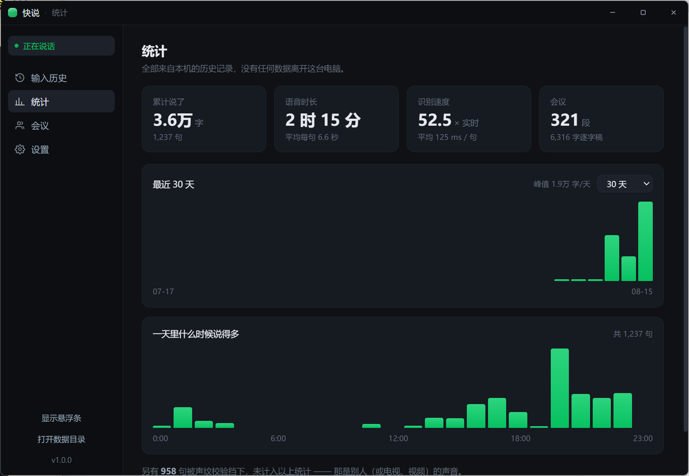
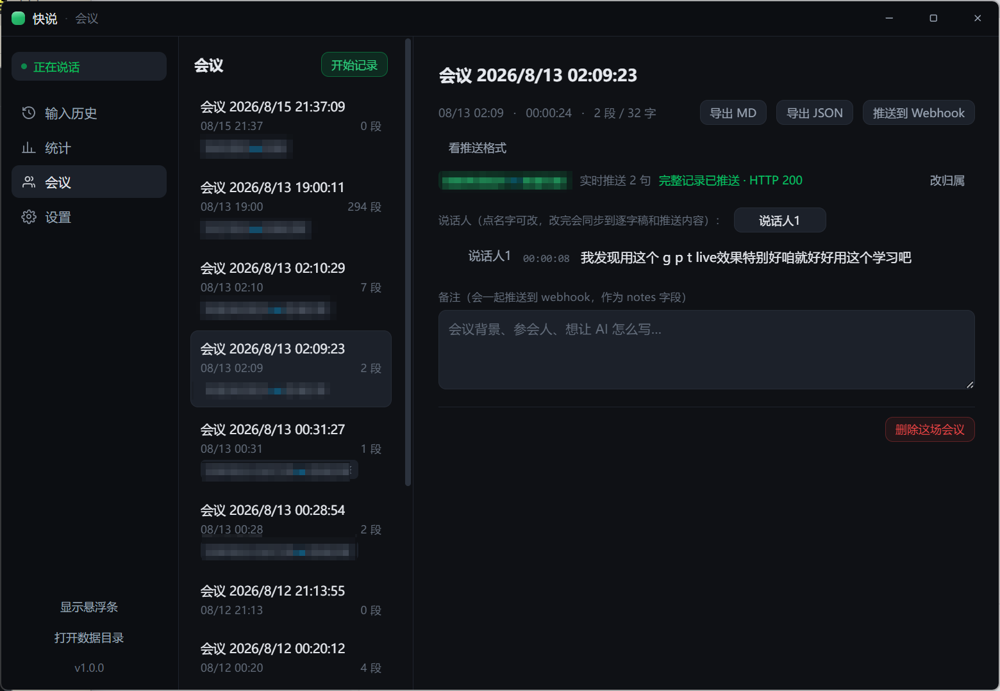

# 快说

**本地语音输入法 + 会议逐字稿。说话，文字直接落到你正在打字的地方。**

Windows · Electron · MIT · [下载最新版](https://github.com/MaskerPRC/kuaishuo/releases/latest)

---

## 录音软件很多，这个不一样在哪

| | |
|---|---|
| **开着就行，不用每次去启动** | 实时录、声纹过滤，不是你的声音一律不进。所以它可以整天挂着——想输入的时候鼠标点进输入框直接说，不需要先去按一个"开始"。这是前两条合起来才成立的用法 |
| **文字直接进光标，不用复制粘贴** | 悬浮条 `focusable: false`，你原来那个窗口**始终是前台窗口**，所以合成的 Ctrl+V 落在你本来就在打字的地方。微信、飞书、VS Code、浏览器地址栏，任何地方 |
| **只认你的声音** | 电视、视频、旁边同事说话麦克风全听得见。能量和频谱**分不出人**（实测几乎完全重叠），声纹向量可以——这是唯一真正管用的那道闸 |
| **全程本地，音频不出这台机器** | SenseVoice-Small 在本机跑。语音这件事，一旦要过一次服务器，密码、薪资、病历就都过了一次别人的服务器 |
| **会议能录到"对方"** | 远程会议对方的声音从你扬声器出来，而麦克风开着回声消除，它的全部工作就是把扬声器减掉。**只靠麦克风的逐字稿天生缺了对话的另一半**——快说额外录一路系统声音补上 |
| **边开会边推给你的系统** | 每识别出一句就实时 POST 到你的接口（1~3 秒内到），带所属项目 ID，不用等散会 |
| **装完即用** | 识别模型（228MB）和声纹模型（27MB）**内置在安装包里**，不用首次启动等下载 |

---

## 长什么样

**输入历史** —— 每一句在识别出来的瞬间就已落盘，崩溃、断电、强杀都不会丢。绿点是已输入，红点是被声纹挡下的别人的声音。



**统计** —— 说了多少、花了多长时间、识别有多快，以及一天里什么时候说得最多。



**会议** —— 只记逐字稿，一个字都不会输入到任何应用里。可导出 MD / JSON，也可以边开边推给你自己的系统（图里那行「实时推送 2 句 · 完整记录已推送 HTTP 200」就是）。



任务栏正上方那枚胶囊，是平时唯一看得见的部分：

```
              刚才识别的那句话，几秒后自己淡出

   ╭───────────────────────────────────────────────╮
   │   ∿∿∿∿∿∿∿∿∿∿∿∿∿∿∿∿∿∿∿∿∿∿∿∿   直接输入   ⏸  ⏺  │
   ╰───────────────────────────────────────────────╯
 ──────────────────────── 任务栏 ────────────────────────
```

- **中间波形**：三条不同频段的丝带，低频宽而慢、齿音细而快。**常驻**——静息时灰色低幅呼吸，听写时转绿并随声起伏，识别中变成一道沿线跑的亮带（而不是闪烁的"识别中…"，那读起来像卡住了）
- **「直接输入」**：点一下切换 直接输入 / 剪贴板 / 仅记录。会议中被计时器顶掉——"正在录音、不会打进你的文档"比"下一句去哪"更要紧
- **右侧两个**：暂停、会议。暂停是你来不及计划就要伸手去按的那个（有人突然跟你说话）

---

## 特性

### 三种开始方式，对应三种意图

| | |
|---|---|
| **按住说**（`Ctrl+Shift+Space`） | 按住、说、松手。快按一下则只听一句，说完自动停 |
| **一直录**（`Ctrl+Shift+D`） | 按一次开始，再按一次停。口述一整段用这个 |
| **会议**（`Ctrl+Shift+M`） | 只记逐字稿，**一个字都不会输入到任何应用里** |

条上没有「开始」按钮。要说话的时候去用鼠标找一个按钮，是所有开始方式里最慢的一种——等你找到了，那句话也忘了。

### 输入这件事本身

- **直接输入** — 剪贴板 + 一次真实的 Ctrl+V。走真实粘贴路径，所以 Draft.js / Lexical / TipTap 这类自己维护文档模型的编辑器不会错乱
- **用完还回剪贴板** — 默认开。输入法不该顺手吃掉你复制的东西
- **不丢** — 每句话在识别出来的**那一瞬间**就 append 落盘（JSONL，长驻 fd）。崩溃、强杀、断电，最多丢掉正在写的那一行

### 声纹校验：唯一真正管用的那道闸

电视、视频、旁边同事说话，麦克风全都听得见。能量和频谱**分不出人**（实测两者几乎完全重叠），声纹向量可以。

录 3 段各 3 秒取平均，之后只有你的声音能驱动输入。阈值 0.5 不是猜的——实测同一人余弦 0.59–0.86，不同人 0.05–0.42，0.5 正落在中间那段空档里。

### 会议模式

- **同时录系统声音**（Windows）— 远程会议里对方的声音是从你扬声器出来的，而麦克风开着回声消除，它的全部工作就是把扬声器从麦克风信号里减掉。**只靠麦克风的逐字稿，天生缺了对话的另一半。**打开后额外录一路系统播放的声音，单独断句、单独分说话人，并且永远不会被标成「我」
- **区分说话人** — 用同一份声纹向量给每段话贴上「我 / 说话人1 / 说话人2」，可改名，改完同步重写整份稿子
- **不输入到任何地方** — 会议的重点是别人在说什么，没人想要一小时的对话被粘进当前文档

### 接到你自己的系统

两个可选的 HTTP 接口，把会议接进你的项目管理平台：

- **会议列表**（GET）— 开始录制前从你的接口拉一份列表选归属。**响应结构不用手写**：点一下「测试拉取」，它会把返回里所有能当列表用的地方连同每个字段的真实取值列出来，下拉框选就行
- **内容推送**（POST）— 每识别出一句**实时推一次**（一句话说完 1~3 秒内到），会议结束再推一份完整逐字稿，都带上所属项目 ID。HMAC 签名、幂等键、4xx 不重试 / 5xx 重投

完整接口文档见 [`docs/integration.md`](docs/integration.md)——给对接方看的，读完就能实现，不需要看客户端代码。

另有一个通用 Webhook：会议结束 POST 整份逐字稿（含 Markdown），失败进持久重投队列。

### 还有

全文搜索历史、重新输入任意一句、按天和按小时的分布统计、临时暂停（麦克风保持开着但不识别）、开机自启。

---

## 跑起来

```bash
npm install
npm run dev
```

`sherpa-onnx-node` 是 N-API 预编译包，Electron 下直接能加载，不用重编。万一换了平台加载失败，`npm run rebuild:electron` 兜底。

打包：

```bash
npm run dist          # → release/，模型内置在安装包里
```

代码签名是可选的，默认不签：设了 `WIN_SIGN_SHA1`（Windows 证书存储里的 SHA-1 指纹）才会走签名流程。`npm run dist:signed` 则要求必须签上，签不上就让构建失败。

> 启动报 `Cannot read properties of undefined (reading 'requestSingleInstanceLock')`，是环境里设了 `ELECTRON_RUN_AS_NODE=1`（某些编辑器/agent 会全局导出）。unset 即可。

### 模型

安装包里**内置了识别模型**（228MB 权重 + 27MB 声纹），装完就能用。从源码跑的话，启动 4 秒后会在后台开始下载，不开麦克风、不亮任何灯；条上会显示 `模型 42%`，波形照常呼吸不被顶掉。

这不是可选的附加项：识别模型是这个 app 唯一的核心资产。做成"首次使用时再拉"的结果是——新用户按下麦克风，得到一个百分比和一条不动的横条，看起来和坏掉一模一样。（这是第一版的真实反馈。）

---

## 验证

```bash
npm test              # 198 单测：存储 / VAD 断句 / 声纹聚类 / webhook / 实时推送 / 结构识别
npm run e2e           # 43 项功能端到端：听写→声纹拦截→会议→改名→推送→断网重投→重启后数据还在
npm run e2e:ui        # 103 项 UI 端到端：真实窗口、真实 DOM、真实 IPC
npm run probe:mic     # 麦克风 + 系统声音链路：权限→设备→AudioContext→worklet 帧计数→电平
npm run probe:project # 会议归属链路：起一个假后端，验证结构识别、实时推送、降级、后端挂掉
npm run probe:perf    # 渲染帧时间 + 主进程阻塞
```

测的是真实模块：真的临时目录、真的 HTTP server、真的 HMAC 校验、真的麦克风。唯一被替换的是"操作系统键盘"——它记录本该被键入的内容，而不是真的去敲。

`e2e:ui` 启动的就是这个 app 本身，然后通过 `executeJavaScript` 去 querySelector、click、读回来：悬浮条是不是真的 `focusable: false`、胶囊下沿距任务栏多少像素、空白处是不是真的点得穿、点一下输出方式主进程的设置有没有变。**没有截图——截图只能猜，DOM 能回答。**

两个有真实副作用的探针要你主动跑：

```bash
npm run probe:inject  # 会往当前前台窗口里打字。倒数 6 秒，期间点进记事本
npm run probe:model   # 会下 228MB 模型并真的过一遍原生解码
```

`probe:model` 覆盖其它测试都够不到的最后一环：一个"能加载但一解码就崩"的原生模块（ABI 不匹配、缺 VC 运行时、asar 打包错误）能通过前面所有测试，然后在用户的第一句话上挂掉。

---

## 一些实现上的选择

**为什么 VAD 在渲染进程**：断句要看实时音频，而渲染层为了画波形本来就拿着每一帧。放这里还意味着送进 SenseVoice 的音频**正好是一句话**——encoder 对帧数是二次的，喂一整场会和喂一句话的差别是 260ms 和好几分钟。

**为什么系统声音是独立的第二路 VAD 而不是混流**：底噪估计是 4 秒滚动窗口的 p20。视频的持续声音会把它一路抬起来，直到麦克风那一路**再也不断句**。两路独立的通道、独立的底噪、独立的断点，只共用一条串行解码队列。

**为什么实时推送敢丢**：它的重试是秒级有界的，失败两次就丢弃并计数。因为逐字稿在识别出来的瞬间已经落盘，会议结束还会整份重推一次——那一路是持久重投的。反过来，如果实时这一路用持久队列，一句话可能在两小时后投进别人的下一场会议里。

**为什么先量再改**：有一次"折射很卡"的报告，量下来渲染层稳定 120fps，开销全在主进程一个按 400ms 轮询的抓屏 API 上（单次 606ms）。又有一次"启动会卡一下"，量下来 1.8 秒的模型加载只堵了主线程 39ms，真凶是另一个 390ms 的一次性调用。两次的直觉都是反的。

---

## License

MIT
